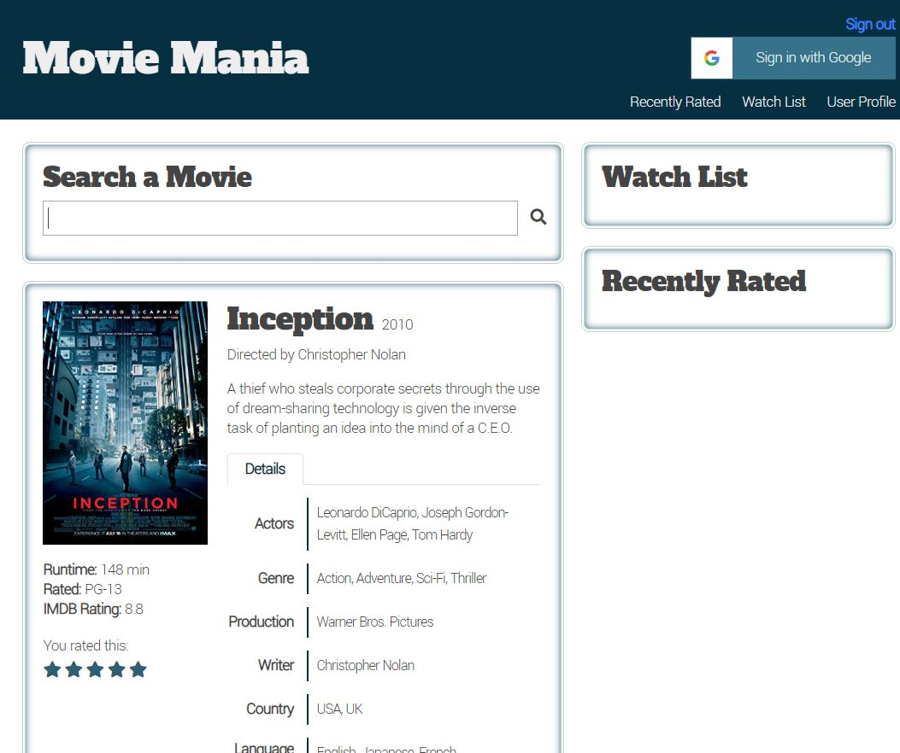
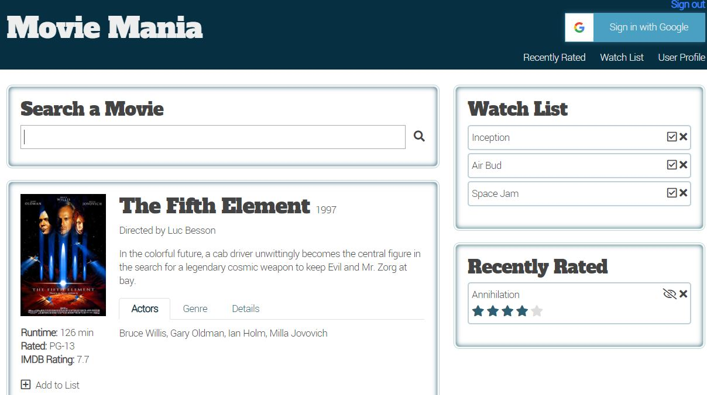

# MovieMania

MovieMania is a Full Stack web application providing users with a personal library of movies they would like to watch, have already watched, and a personal rating for each movie.

[Link to the live application](https://ancient-bastion-34288.herokuapp.com/)

## Sample

This application uses Google Authorization to allow users to sign-in with their Google account and create a watch list specifically for themselves.

Additionally, this application utilizes the Open Movie Database (OMDb) API to search for movies. Searching for a movie displays the poster and basic information about the movie to the user, at which point they can add it to their watch list or rate the movie.

Rating a movie or adding it to the watch list stores the movie information in a MySQL database for retrieval at any time when the user logs into the app. The database also stores the rating and "watched" boolean.

Here is a screenshot of a working watch list and rated movie:

## Tech Used:

- HTML
- CSS / Bootstrap
- JavaScript
- jQuery
- Express.js
- MySQL
- Node.js
    - mysql
    - express
    - dotenv
    - fs
    - path
    - sequelize ORM
- VUE.js
- [OMDb API](http://www.omdbapi.com/)
- Heroku
- JawsDB

## Contributors

- Donna Kuang
- Kevin Bevil
- Joe Keegan
- Justin Chastain

